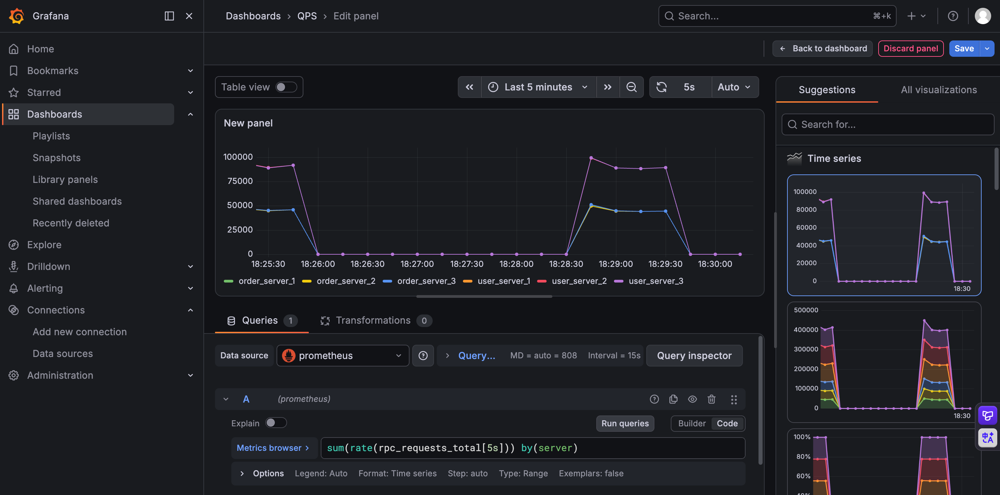

# **轻量级高性能分布式 RPC 通信框架**

## **项目背景**

本项目受 OpenHarmony 跨进程通信（IPC）与 IDL 机制启发，为了在 Linux 环境下抽象出通用、高效的网络通信能力，独立设计并实现的一套基于 C++17 的轻量级分布式 RPC 框架。

项目采用 Reactor 多线程网络模型，集成了自定义应用层通信协议、Protobuf 序列化以及 ZooKeeper 服务治理。框架屏蔽了底层网络细节，实现了服务自动注册发现、节点动态感知及高可用远程调用。在追求极低通信延迟的同时，具备完善的**云原生可观测性**与**优雅停机**能力。


*(图：基于 Prometheus + Grafana 的 RPC 集群实时性能监控大盘，支持百万级并发压测观测)*

## **核心特性**

* **现代 C++ 架构**：基于 C++17 开发，大量使用智能指针、原子操作、读写锁、闭包 (Lambda) 及 RAII 机制，保证内存安全与极致的高并发性能。  
* **Reactor 多线程网络模型**：底层网络通信基于 epoll + Reactor 模型 (Muduo)，支持极高并发的非阻塞网络 I/O。  
* **云原生可观测性 (Observability)**：  
  * 内置轻量级 HTTP Server 暴露标准 Metrics 接口。  
  * 无缝对接 **Prometheus + Grafana**，实时监控集群整体及单节点的 QPS 吞吐量、活跃请求数 (In-flight Requests) 以及错误率。  
* **高可用服务治理 (ZooKeeper)**：  
  * **自动注册与发现**：基于 ZK 临时节点机制，服务端启动自动注册，宕机自动剔除。  
  * **动态感知**：客户端集成 ZK Watcher 机制，实时感知服务端集群的上下线变化，自动刷新本地服务路由缓存。  
* **高级容错与负载均衡**：  
  * 实现了基于原子的轮询 (Round-Robin) 客户端负载均衡策略，确保流量均匀分发。  
  * 具备建连重试与死节点精准剔除机制，保障单节点宕机时的业务高可用。  
* **高性能连接池机制**：内部实现线程安全的 TCP 长连接池，并实现了心跳探测机制。  
* **企业级优雅停机 (Graceful Shutdown)**：  
  * 守护线程拦截 SIGINT/SIGTERM 系统信号。  
  * 停机时主动断开 ZK 摘除流量，并基于条件变量严格等待所有 In-flight 活跃请求处理完毕后平滑退出，实现业务无损发布。

## **编译**

### **环境依赖**

* Ubuntu (支持 x86_64 / aarch64)  
* GCC & CMake  
* Boost & Glog  
* Protobuf  
* ZooKeeper (C Client)  
* Muduo

### **快速构建**

本项目提供了一键构建脚本 build.sh，运行后会自动安装所需的系统依赖并进行全量编译：
```bash
git clone https://github.com/aaronshqliu/rpc_project.git
cd rpc_project  
chmod +x build.sh
```
#### **方式一：常规编译（Release 模式）**

默认开启 -O3 最高级别优化，提供最佳性能，适用于性能压测与生产环境。
```bash
./build.sh
```
#### **方式二：调试编译（Debug 模式）**

开启 -g 并关闭优化（-O0），保留完整的函数调用栈信息，适用于使用 GDB 进行单步调试或问题排查。
```bash
./build.sh --debug
```
### **使用 CMake 手动构建**

如果你已经完成了环境配置，或者希望手动控制编译流程，也可以直接使用标准的 CMake 命令。构建模式的默认逻辑与脚本一致：
```bash
mkdir build && cd build
```
# 默认编译 Release 版本 (等效于 ./build.sh)
```bash
cmake ..  
make -j$(nproc)
```
# 编译 Debug 版本 (等效于 ./build.sh --debug)
```bash
cmake -DCMAKE_BUILD_TYPE=Debug ..  
make -j$(nproc)
```
## **运行示例**

### **1. 启动基础组件 (ZooKeeper)**

请确保本地或远端的 ZooKeeper 服务已启动：
```bash
./zkServer.sh start
```
### **2. 启动监控大盘 (Prometheus + Grafana)**

项目内置了 Docker Compose 编排文件，一键拉起监控基础设施：
```bash
cd monitor  
docker compose up -d
```
启动后，可通过浏览器访问 http://<宿主机IP>:3000 (账号密码: admin) 查看实时 QPS 大盘。

### **3. 启动 RPC 服务端集群**

配置文件中需将 rpc_server_ip 设置为 0.0.0.0 以允许外部网络 (及 Prometheus) 访问：
```bash
./bin/user_server -i ./conf/user_server_1.conf  
./bin/user_server -i ./conf/user_server_2.conf  
./bin/user_server -i ./conf/user_server_3.conf

./bin/order_server -i ./conf/order_server_1.conf  
./bin/order_server -i ./conf/order_server_2.conf  
./bin/order_server -i ./conf/order_server_3.conf
```
### **4. 启动 RPC 客户端 (压测)**
```bash
./bin/client -i ./conf/client.conf
```
## **未来规划 (TODO)**

* [ ] 引入一致性哈希（Consistent Hashing）负载均衡算法。  
* [ ] 支持异步 RPC 调用（Future / Promise 模式）。  
* [ ] 引入分布式链路追踪（如 OpenTelemetry/Jaeger），实现跨 RPC 请求的全链路监控。

*If this project helps you, please give it a ⭐!*
